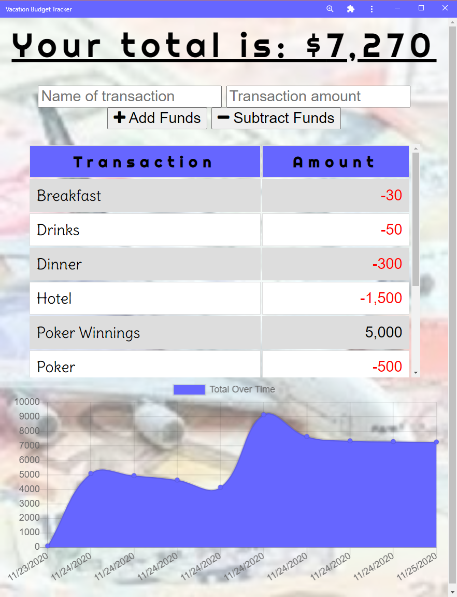

# Offline Budget Tool

  

## Description

A budget tool that allows users to enter deposits and withdrawals without internet connection, that will be uploaded when the connection is back online.

Link to live site: [Offline Budget Tool](https://hidden-mesa-98938.herokuapp.com/)

Link to Heroku Repo: [Heroku Repo](https://dashboard.heroku.com/apps/hidden-mesa-98938)

## Table of Contents

* [License](#license)
* [Contributing](#contributing)
* [Questions](#questions)

## License

MIT License

Copyright (c) 2020 Clarissa

## Contributing

When contributing to this repository, please first discuss the change you wish to make via issue, email, or any other method with the owner(s) of this repository before making a change.

## Questions

For any questions the author can be contacted at:

GitHub: @[clarissareeve](https://github.com/clarissareeve)

Email: clarissa.reeve@gmail.com
